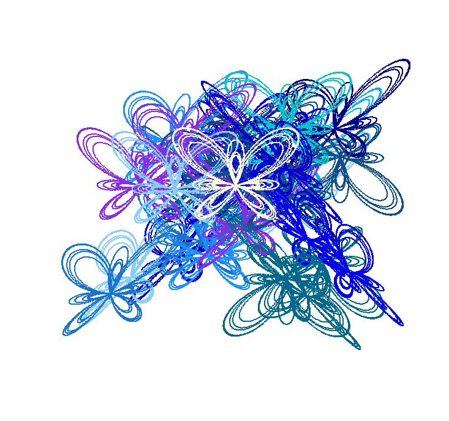

# Butterfly Curve
Discovered by Temple Fay in 1989

where lamda = 4 and 0 <= t <= 12pi

### Plot the butterfly
```
t <-  seq(0,(12*pi)/4, 0.01) # for one set of wings
t <-  seq(0,12*pi, 0.001)    # for all sets of wings
df <- butterflyCurve(t, lamda=4)
plot(y ~ x, data = df, type='line', col="blueviolet", xaxt='n', yaxt='n') 
```

### What happens when we change lamda?
```
lamda <- seq(1,6)
for(i in lamda){
  plot(y ~ x, data = butterflyCurve(t, lamda=i), type='line',
       xlab=paste("lamda = ", i))
}
```

### Plot a collection of butterflies (also know as a kaleidoscope of butterflies)
```
paint <- c("blueviolet","blue3","blue2","royalblue4","royalblue2","navyblue","deepskyblue4","deepskyblue2",
           "dodgerblue4", "dodgerblue3","dodgerblue1","lightskyblue","steelblue","turquoise3")
t <-  seq(0,(12*pi), 0.01)
df <- kaleidoscope(t, paint=paint, butterflies = 30)
plot(y ~ x, data=df, pch=20, cex=0.5, col=df$paint, bty="n", xaxt='n', yaxt='n', xlab="", ylab="")
points(y ~ x, data= butterflyCurve(t), pch=20, cex=0.5, col="cornsilk", bty="n", xaxt='n', yaxt='n', xlab="", ylab="")
```



<p align="center">
:honeybee: :honeybee: :butterfly:
</p>